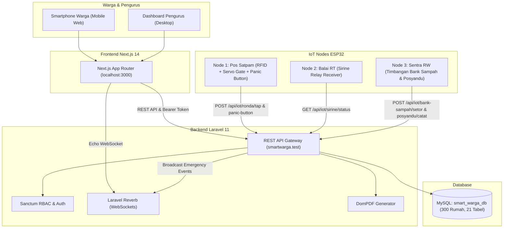

# SMART-WARGA — Digital Management System
### Web + IoT Integrated Platform untuk Lingkungan Warga Modern (RW & RT)

Platform digital terpadu untuk tata kelola administrasi rukun warga, transparansi keuangan lingkungan (IPL & Bank Sampah), pelayanan persuratan, serta integrasi hardware IoT (Gate Otomatis, Panic Button Darurat, Sirine Wilayah, dan Kios Posyandu Mandiri).

---

## 🏛️ Arsitektur Monorepo

```
smartwarga/
├── backend/            → Laravel 11+ RESTful API + Sanctum + Reverb WebSocket + MySQL
├── frontend/           → Next.js 14+ (App Router), Tailwind CSS, Lucide Icons, Responsive UI
├── firmware/           → Sketsa Arduino C++ untuk 3 Node ESP32 (Gate, Sirine, Bank Sampah)
└── README.md           → Dokumentasi Utama Sistem Monorepo
```



---

## 👥 Spesifikasi Wilayah & User Roles (RBAC)

- **Cakupan Wilayah:** 1 Rukun Warga (RW 05) menaungi 3 Rukun Tetangga (RT 01, RT 02, RT 03).
- **Kapasitas Hunian:** Masing-masing RT memiliki kuota 100 unit rumah terdata (Total 300 unit rumah: Blok A1-A25, B1-B25, C1-C25, D1-D25 per RT).
- **Daftar Role:**
  * `super_admin`: Akses menyeluruh sistem.
  * `rw`: Validasi surat akhir, broadcast kegiatan tingkat RW, monitoring kas RW.
  * `rt`: Approval pendaftaran warga baru, approval surat tingkat RT, tagihan IPL RT.
  * `bendahara`: Verifikasi pembayaran IPL, verifikasi top-up dompet, pencairan pinjaman & santunan RUKAM.
  * `sekretaris`: Pengelolaan arsip dan pengumuman kegiatan.
  * `warga`: Mengajukan surat, bayar IPL, transaksi bank sampah, lapor aduan, belanja UMKM.

### Approval Workflow Pendaftaran Warga
1. Warga mendaftar via web dengan memilih RT, Blok, dan Nomor Rumah (+ opsional UID Kartu RFID).
2. Status pendaftaran awal adalah **`pending`**.
3. Akun `pending` hanya dapat melihat profil. Seluruh menu layanan akan terkunci.
4. Pengurus RT memeriksa dan mengklik tombol **ACC / Approve**.
5. Status berubah menjadi **`approved`**, rumah ditandai terhuni, dan seluruh fitur langsung aktif.

---

## ⚡ 3 Node Integrasi Hardware IoT (ESP32)

### 1. Node 1: Pos Satpam / Gerbang Masuk Utama
- **Hardware:** ESP32 + RFID RC522 + Servo SG90 + Push Button Darurat.
- **Fitur:**
  * Tap RFID ronda malam -> Sistem mencocokkan jadwal ronda -> Palang pintu servo terbuka 90° selama 4 detik.
  * Panic Button -> Mengaktifkan alarm bahaya di database & broadcast real-time ke seluruh web warga.

### 2. Node 2: Titik Sirine Wilayah RT
- **Hardware:** ESP32 + Modul Relay 5V + Horn Sirine 12V/220V + Strobe LED.
- **Fitur:** Polling status darurat setiap 3 detik -> Menyalakan sirine otomatis saat terjadi bahaya/panic button.

### 3. Node 3: Terminal Mandiri Bank Sampah & Posyandu
- **Hardware:** ESP32 + RFID RC522 + Timbangan Load Cell HX711 + Sensor Jarak HC-SR04 + LCD 16x2 I2C.
- **Fitur:**
  * Mode Bank Sampah: Timbang sampah kaleng / plastik -> Tap kartu RFID -> Sistem otomatis menghitung nilai rupiah dan langsung mengkreditkan saldo ke Dompet Warga!
  * Mode Posyandu: Pengukuran mandiri berat badan & tinggi badan balita tercatat otomatis ke rekam medis posyandu.

---

## 📦 11 Modul Lengkap & Status Pengujian (104 Tests, 500 Assertions — 100% PASS)

| No | Modul Sistem | Cakupan Fitur | Test Suite |
|:---:|:---|:---|:---:|
| 1 | **Sensus 300 Hunian & KK Digital** | Struktur multi-keluarga per rumah, penetapan Kepala Keluarga, relasi anggota keluarga. | Feature Tested |
| 2 | **IPL 12 Bulan, QRIS & Kas RT/RW** | Kalender tagihan 12 bulan, QRIS statis & dompet, auto-split kas RT (60%) & RW (40%). | Feature Tested |
| 3 | **Payroll Satpam & Petugas Sampah** | Penggajian rutin, audit kas operasional, approval berjenjang pengurus. | Feature Tested |
| 4 | **Persuratan Digital & Download PDF** | SKCK, Domisili, SKTM, approval berjenjang RT/RW, generate & download PDF stempel digital. | `LetterTest.php` (15 tests) |
| 5 | **Layanan Pengaduan Warga** | Lapor aduan dengan foto, tracking status realtime (*Laporan Masuk -> Diproses -> Selesai*). | `ComplaintTest.php` (10 tests) |
| 6 | **Peminjaman Aset Fasum & Donasi** | Peminjaman tenda, sound system, kursi warga, batas kapasitas, dan donasi kas pemeliharaan. | `AssetLoanTest.php` (14 tests) |
| 7 | **Koperasi Simpan Pinjam & UMKM** | Plafon pinjaman s.d Rp 50jt, bunga 1%/bulan, etalase katalog produk & order WA penjual. | `KoperasiAndUmkmTest.php` (11 tests) |
| 8 | **Posyandu Digital Terpadu** | KMS Balita mandiri, jadwal imunisasi wajib anak, dan skrining berkala kesehatan lansia. | `PosyanduDigitalTest.php` (12 tests) |
| 9 | **RUKAM & Ambulans Siaga Warga** | Santunan duka kematian Rp 2.500.000, armada ambulans 24/7, booking darurat & dispatch. | `RukamAndAmbulanceTest.php` (14 tests) |
| 10 | **Monitoring Wilayah & IoT Hardware** | Tap RFID gerbang servo 90°, Panic Button, horn sirine relay, timbangan bank sampah HX711 LCD 16x2. | `IoTMonitoringTest.php` (17 tests) |
| 11 | **Agenda Warga, RSVP & LPJ Keuangan** | Countdown Hari-H/H-1/H-7, RSVP hadir/izin (+ alasan), donasi swadaya, dan LPJ realisasi transparan. | `AnnouncementTest.php` (11 tests) |

---

## 🔑 Kredensial Akun Percobaan (Seeded Accounts)

Password untuk semua akun: **`password`**

- **Super Admin:** `admin@smartwarga.test`
- **Ketua RW:** `rw@smartwarga.test`
- **Ketua RT 01:** `rt01@smartwarga.test`
- **Bendahara RT 01:** `bendahara@smartwarga.test`
- **Sekretaris RT 01:** `sekretaris@smartwarga.test`
- **Warga Aktif (Budi Santoso):** `budi@smartwarga.test` (Saldo Dompet: Rp 150.000, RFID: `RFID_WARGA_01`)
- **Warga Pending (Siti Rahma):** `siti@smartwarga.test` (Menunggu ACC RT)

---

## 🚀 Panduan Menjalankan Sistem

### 1. Backend Laravel
```bash
cd backend
composer install
# Hubungkan ke domain local Herd
herd link smartwarga
# Jalankan migrasi dan seeder
php artisan migrate:fresh --seed
php artisan storage:link

# Menjalankan seluruh 104 automated test suite (500 assertions)
php artisan test
```
Backend siap diakses pada: `http://smartwarga.test`

### 2. Frontend Next.js
```bash
cd frontend
npm install
npm run dev
# Build verifikasi produksi (Turbopack)
npm run build
```
Frontend siap diakses pada: `http://localhost:3000`

### 3. Firmware ESP32
Buka sketsa pada direktori `firmware/` menggunakan Arduino IDE, sesuaikan SSID/Password WiFi dan IP host backend, lalu upload ke board ESP32 (Node 1 Gate/Panic, Node 2 Siren Relay, Node 3 Timbangan Bank Sampah).

