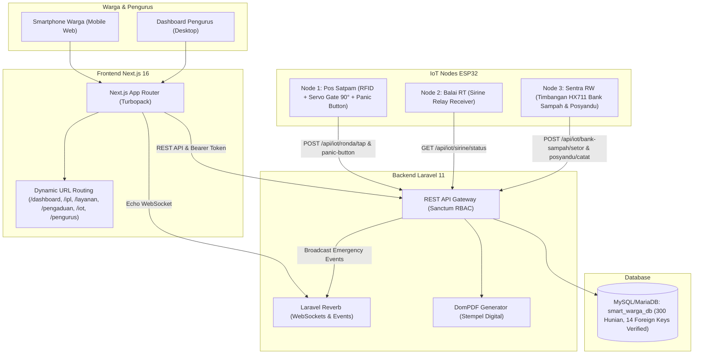

# SMART-WARGA — Digital Management System
### Web + IoT Integrated Platform untuk Lingkungan Warga Modern (RW & RT)

Platform digital terpadu untuk tata kelola administrasi rukun warga, transparansi keuangan lingkungan (IPL & Bank Sampah), pelayanan persuratan, serta integrasi hardware IoT (Gate Otomatis, Panic Button Darurat, Sirine Wilayah, dan Kios Posyandu Mandiri).

---

## 🏛️ Arsitektur Monorepo

```
smartwarga/
├── backend/            → Laravel 11+ RESTful API + Sanctum + Reverb WebSocket + MySQL/MariaDB
├── frontend/           → Next.js 16+ (App Router), Tailwind CSS, Lucide Icons, Responsive UI
├── firmware/           → Sketsa Arduino C++ untuk 3 Node ESP32 (Gate, Sirine, Bank Sampah)
└── README.md           → Dokumentasi Utama Sistem Monorepo
```



---

## 🧭 Dynamic URL Routing (Clean Slashes & Deep Linking)

Aplikasi telah dilengkapi sinkronisasi dua arah (*bidirectional URL synchronization*) menggunakan History API (`pushState` & `popstate`), sehingga address bar browser selalu menampilkan lokasi halaman secara rapi dan mendukung *refresh/deep-link*:

* **`/dashboard`** : Beranda Warga & Accordion Kartu Keluarga (KK Utama & KK Pendukung)
* **`/ipl`** : Kalender 12 Bulan Iuran IPL, Riwayat Pembayaran, & QRIS
* **`/layanan`** : Portal Layanan Warga
  * `/layanan/surat` : Pengajuan Surat Digital (SKCK, Domisili, SKTM, Usaha)
  * `/layanan/umkm` : Etalase Produk UMKM Warga & WhatsApp Order
  * `/layanan/koperasi` : Koperasi Simpan Pinjam (Bunga 1%/bln)
  * `/layanan/aset` : Peminjaman Tenda, Sound System, & Aset Fasum
  * `/layanan/posyandu` : Layanan Posyandu Balita & Skrining Lansia
  * `/layanan/rukam` : RUKAM (Santunan Duka) & Booking Ambulans 24/7
* **`/pengaduan`** : Pusat Pengaduan & Aspirasi Warga (+ Riwayat Respon Pengurus)
* **`/iot`** : Monitoring Wilayah IoT Live (Kontrol Sirine, Log Gate, & Timbangan)
* **`/pengurus`** : Dashboard Khusus Pengurus RT/RW
  * `/pengurus/sensus` : Manajemen Sensus 300 Hunian & KK Digital
  * `/pengurus/ipl` : Audit Rekap Kas RT (60%) & Kas RW (40%)
  * `/pengurus/kegiatan` : Agenda & Publikasi LPJ Transparan

---

## 👥 Spesifikasi Wilayah & User Roles (RBAC)

- **Cakupan Wilayah:** 1 Rukun Warga (RW 05) menaungi 3 Rukun Tetangga (RT 01, RT 02, RT 03).
- **Kapasitas Hunian:** Masing-masing RT memiliki kuota 100 unit rumah terdata (Total 300 unit rumah: Blok A1-A25, B1-B25, C1-C25, D1-D25 per RT).
- **Struktur Kartu Keluarga (KK):**
  * **KK Utama (KK Inti):** Pemilik/Penanggung Jawab Rumah yang berkewajiban atas iuran IPL unit.
  * **KK Pendukung (KK Tambahan):** Keluarga mandiri yang tinggal satu atap; sah terdata sensus & berhak layanan administrasi **bebas pungutan IPL ganda**.
- **Daftar Role:**
  * `super_admin`: Akses menyeluruh sistem dan konfigurasi IoT.
  * `rw`: Validasi surat akhir, broadcast kegiatan tingkat RW, monitoring kas RW.
  * `rt`: Approval pendaftaran warga baru, approval surat tingkat RT, tagihan IPL RT.
  * `bendahara`: Verifikasi pembayaran IPL, verifikasi top-up dompet, pencairan pinjaman & santunan RUKAM.
  * `sekretaris`: Pengelolaan arsip dan pengumuman kegiatan.
  * `warga`: Mengajukan surat, bayar IPL, transaksi bank sampah, lapor aduan, belanja UMKM.

### Approval Workflow Pendaftaran Warga
1. Warga mendaftar via web dengan memilih RT, Blok, dan Nomor Rumah (+ opsional UID Kartu RFID).
2. Status pendaftaran awal adalah **`pending`**.
3. Akun `pending` hanya dapat melihat profil. Seluruh menu layanan akan terkunci.
4. Pengurus RT memeriksa dan mengklik tombol **ACC / Approve**.
5. Status berubah menjadi **`approved`**, rumah ditandai terhuni, dan seluruh fitur langsung aktif.

---

## ⚡ 3 Node Integrasi Hardware IoT (ESP32)

### 1. Node 1: Pos Satpam / Gerbang Masuk Utama
- **Hardware:** ESP32 + RFID RC522 + Servo SG90 + Push Button Darurat.
- **Endpoint:**
  * `POST /api/iot/ronda/tap`  
    Payload: `{"rfid_uid": "STRING", "post_id": "POS_01"}`  
    Respon: `gate_open: true`, `servo_angle: 90`, `open_duration_ms: 4000`, `lcd_line1`, `lcd_line2`.  
    *Jika kartu tidak terdaftar:* HTTP 404, `gate_open: false`, LCD `KARTU DITOLAK` / `TIDAK TERDAFTAR`.
  * `POST /api/iot/panic-button`  
    Payload: `{"location": "STRING", "trigger_type": "hardware_button"}`  
    Respon: HTTP 201, `siren_triggered: true`, membuat log darurat aktif di database & broadcast WebSocket.

### 2. Node 2: Titik Sirine Wilayah RT
- **Hardware:** ESP32 + Modul Relay 5V + Horn Sirine 12V/220V + Strobe LED.
- **Endpoint:**
  * `GET /api/iot/sirine/status`  
    Respon: `{"siren_active": true/false, "reason": "STRING", "timestamp": "..."}`  
    ESP32 melakukan polling setiap 3–5 detik.
  * `POST /api/iot/sirine/toggle`  
    Payload: `{"is_active": false, "reason": "Terkendali"}`  
    Mematikan sirine sekaligus otomatis menandai seluruh insiden aktif menjadi `status: handled` dengan stempel waktu `resolved_at`.

### 3. Node 3: Terminal Mandiri Bank Sampah & Posyandu
- **Hardware:** ESP32 + RFID RC522 + Timbangan Load Cell HX711 + Sensor Jarak HC-SR04 + LCD 16x2 I2C.
- **Endpoint:**
  * `POST /api/iot/bank-sampah/setor`  
    Payload: `{"rfid_uid": "STRING", "kategori": "kaleng|plastik", "berat_gram": NUMBER}`  
    *Logika:* Menghitung $\text{Nominal} = (\text{berat\_gram} / 1000) \times \text{Tarif}$ (min Rp 100).  
    Kredit otomatis masuk ke `Wallet` warga via *DB Transaction*, tercatat di buku besar `WalletTransaction` (ref: `BS-...`), dan menghasilkan output teks LCD 16x2 terformat.
  * `POST /api/iot/posyandu/catat`  
    Payload: `{"rfid_uid": "STRING", "berat_kg": NUMBER, "tinggi_cm": NUMBER}`  
    Tercatat otomatis ke rekam medis KMS balita.

---

## 📦 11 Modul Lengkap & Status Pengujian (105 Tests, 507 Assertions — 100% PASS)

| No | Modul Sistem | Cakupan Fitur | Test Suite |
|:---:|:---|:---|:---:|
| 1 | **Sensus 300 Hunian & KK Digital** | Struktur multi-keluarga (KK Utama & KK Pendukung), penetapan Kepala Keluarga, relasi anggota keluarga. | Feature Tested |
| 2 | **IPL 12 Bulan, QRIS & Kas RT/RW** | Kalender tagihan 12 bulan, QRIS statis & dompet, auto-split kas RT (60%) & RW (40%). | `IplAccumulationTest.php` (2 tests) |
| 3 | **Payroll Satpam & Petugas Sampah** | Penggajian rutin, audit kas operasional, approval berjenjang pengurus. | Feature Tested |
| 4 | **Persuratan Digital & Download PDF** | SKCK, Domisili, SKTM, approval berjenjang RT/RW, generate & download PDF stempel digital. | `LetterTest.php` (15 tests) |
| 5 | **Layanan Pengaduan Warga** | Lapor aduan dengan foto, tracking status realtime (*Laporan Masuk -> Diproses -> Selesai*), robust timeline. | `ComplaintTest.php` (10 tests) |
| 6 | **Peminjaman Aset Fasum & Donasi** | Peminjaman tenda, sound system, kursi warga, batas kapasitas, dan donasi kas pemeliharaan. | `AssetLoanTest.php` (14 tests) |
| 7 | **Koperasi Simpan Pinjam & UMKM** | Plafon pinjaman s.d Rp 50jt, bunga 1%/bulan, etalase katalog produk & order WA penjual. | `KoperasiAndUmkmTest.php` (11 tests) |
| 8 | **Posyandu Digital Terpadu** | KMS Balita mandiri, jadwal imunisasi wajib anak, dan skrining berkala kesehatan lansia. | `PosyanduDigitalTest.php` (12 tests) |
| 9 | **RUKAM & Ambulans Siaga Warga** | Santunan duka kematian Rp 2.500.000, armada ambulans 24/7, booking darurat & dispatch. | `RukamAndAmbulanceTest.php` (14 tests) |
| 10 | **Monitoring Wilayah & IoT Hardware** | Tap RFID gerbang servo 90°, Panic Button, horn sirine relay, timbangan bank sampah HX711 LCD 16x2. | `IoTMonitoringTest.php` (17 tests) |
| 11 | **Agenda Warga, RSVP & LPJ Keuangan** | Countdown Hari-H/H-1/H-7, RSVP hadir/izin (+ alasan), donasi swadaya, dan LPJ realisasi transparan. | `AnnouncementTest.php` (14 tests) |

---

## 🔒 Audit Integritas Relasi Database (Foreign Key Health Check)

Seluruh 14 relasi foreign key pada database operasional telah diverifikasi dengan rasio **0 Orphan Record (100% Konsisten)**:

1. `users.house_id` $\rightarrow$ `houses.id` (0 Orphan)
2. `wallets.user_id` $\rightarrow$ `users.id` (100% warga memiliki dompet aktif)
3. `wallet_transactions` $\rightarrow$ `wallets.id` & `users.id` (0 Orphan)
4. `letters.user_id` $\rightarrow$ `users.id` (0 Orphan)
5. `complaints.user_id` $\rightarrow$ `users.id` (0 Orphan)
6. `asset_loans` $\rightarrow$ `users.id` & `assets.id` (0 Orphan)
7. `umkm_products` $\rightarrow$ `users.id` (0 Orphan)
8. `koperasi_loans` $\rightarrow$ `users.id` (0 Orphan)
9. `ambulance_bookings` $\rightarrow$ `users.id` & `ambulances.id` (0 Orphan)
10. `rukam_reports` $\rightarrow$ `users.id` (0 Orphan)
11. `posyandu_records` $\rightarrow$ `users.id` (0 Orphan)
12. `elderly_health_records` $\rightarrow$ `users.id` (0 Orphan)
13. `announcement_donations` $\rightarrow$ `users.id` (0 Orphan)
14. `ronda_logs` & `waste_bank_transactions` $\rightarrow$ `users.id` (0 Orphan)

---

## 🔑 Kredensial Akun Percobaan (Seeded Accounts)

Password untuk semua akun: **`password`**

- **Super Admin:** `admin@smartwarga.test`
- **Ketua RW:** `rw@smartwarga.test`
- **Ketua RT 01:** `rt01@smartwarga.test`
- **Bendahara RT 01:** `bendahara@smartwarga.test`
- **Sekretaris RT 01:** `sekretaris@smartwarga.test`
- **Warga Aktif (Budi Santoso):** `budi@smartwarga.test` (Saldo Dompet Aktif, RFID: `RFID_WARGA_01`)
- **Warga Pending (Siti Rahma):** `siti@smartwarga.test` (Menunggu ACC RT)

---

## 🚀 Panduan Menjalankan Sistem Lokal

### 1. Backend Laravel
```bash
cd backend
composer install
# Hubungkan ke domain local Herd
herd link smartwarga
# Jalankan migrasi dan seeder
php artisan migrate:fresh --seed
php artisan storage:link

# Menjalankan seluruh 105 automated test suite (507 assertions)
php artisan test
```

### 2. Frontend Next.js
```bash
cd frontend
npm install
npm run dev

# Build verifikasi produksi (Turbopack)
npm run build
```
Frontend siap diakses pada: `http://localhost:3000`

### 3. Firmware ESP32
Buka sketsa pada direktori `firmware/` menggunakan Arduino IDE, sesuaikan SSID/Password WiFi dan IP host backend, lalu upload ke board ESP32 (Node 1 Gate/Panic, Node 2 Siren Relay, Node 3 Timbangan Bank Sampah).

---

## 🌐 Live Production Deployment

Sistem telah aktif secara penuh pada server VPS Ubuntu 22.04 LTS:
- **Domain Resmi Warga & Pengurus (SSL HTTPS):**  
  👉 **[https://swarga.manajemensystem.my.id](https://swarga.manajemensystem.my.id)**
- **Yatindo System Hub Portal:**  
  👉 **[http://202.155.13.156](http://202.155.13.156)** (Kartu: 🏘️ SMART-WARGA)
- **High-Speed IoT Dedicated Port:**  
  👉 `http://202.155.13.156:8004` (ESP32 Gate RFID, Sirine, & Timbangan)
- **Database Engine:** MariaDB `smartwarga_db`
- **Sertifikat Keamanan:** Let's Encrypt Wildcard/SAN Valid TLS 1.3
